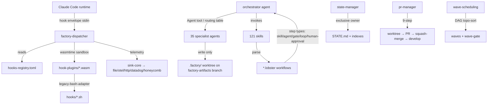

# Phase 0 — Semantic Context: vsdd-factory

> Semantic map of the EXTRACTION SOURCE for game-factory (greenfield). This is
> NOT a brownfield adoption of vsdd-factory; we extract its engine- and
> methodology-neutral orchestration spine (~70%) and replace its VSDD
> software-verification quality model (~30%) with a game-appropriate one.
> Source: `.reference/vsdd-factory`, branch `develop` @ `82163b7`.

## 1. What vsdd-factory is

vsdd-factory is an open-source **multi-agent orchestration engine** implementing
Verification-Specification-Driven Development (VSDD). It turns a product brief
into production-grade code through specialist agents, adversarial review, and
asymptotic convergence cycles. It is distributed as a **Claude Code plugin**
(`vsdd-factory:*` agents and skills) plus a **Rust workspace** that builds the
hook dispatcher and its WASM hook plugins.

It is **self-referential**: the engine is also the product being onboarded
(`.factory/` writes target its own repo). It currently runs in a continuous F5
"engine-discipline" cycle-level adversarial-review asymptotic convergence mode.

## 2. Two-part physical structure

The repo has two cleanly-separated halves, and the extraction seam runs *between
the Rust runtime (neutral) and the plugin content (mixed)*:

### A. Rust workspace — `crates/` (~80k LOC incl. tests; ~27k in dispatcher)

| Crate / group | Purpose | Neutrality |
|---|---|---|
| `factory-dispatcher` | CLI binary: reads a Claude Code hook envelope on stdin, loads `hooks-registry.toml`, selects plugins by event/tool, executes them in a `wasmtime` sandbox (sync/async tiers, fuel budgets), aggregates verdicts (block/advisory), emits telemetry. Single-thread tokio. | **Fully neutral** — knows nothing about BC/VP/VSDD; pure WASM host + router. |
| `hook-sdk` + `hook-sdk-macros` | SDK + proc-macros plugins compile against (capabilities: read_file, write_file, exec_subprocess, emit_event, env, log, memory). | **Fully neutral** — generic plugin ABI. |
| `vsdd-context-resolvers` | Context resolution helpers used by dispatch (resolver registry, determinism proptest). Named "vsdd" but mechanism-generic. | Neutral mechanism, VSDD-named. |
| `sink-core` + `sink-file/-otel-grpc/-http/-datadog/-honeycomb` | Pluggable telemetry sink backends (observability fan-out). | **Fully neutral** — standard observability. |
| `hook-plugins/*` (28 crates) | Individual WASM hook plugins. **MIXED**: some neutral (worktree, telemetry, wave-merge, agent tracking, artifact-path, state-structure), some VSDD-coupled (`regression-gate`, `validate-per-story-adversary-convergence`, `validate-burst-log`, `validate-closes-completeness`). | **Split — the seam runs through this directory.** |

The dispatcher binary is **cross-compiled** (darwin-arm64/x64, linux-x64/musl,
windows-x64) and consumed at the operator level from a marketplace tarball; source
edits require a release to take effect.

### B. Claude Code plugin — `plugins/vsdd-factory/` (~34k LOC of .md)

| Subdir | Count | Purpose | Neutrality |
|---|---|---|---|
| `agents/` | 35 agents (`.md` prompts) + `orchestrator/` sequences | The studio-of-agents roster. | **Mixed** — most neutral; ~6 are VSDD-quality-model-specific. |
| `skills/` | 121 skills (`SKILL.md`) | Reusable procedures invoked by the orchestrator / slash commands. | **Mixed** — most neutral; ~12 are VSDD-quality-specific. |
| `workflows/` | 8 `.lobster` YAML pipelines + `phases/` (8 phase workflows) | The pipeline definitions parsed by `lobster-parse`. | **Mostly neutral structure**, with discrete VSDD phase steps that excise cleanly. |
| `hooks/` | 35 top-level `.sh` bash hooks + 11 in `dim2-gates/` + 1 in `lib/` (47 total) + `hooks-registry.toml` + dispatcher bins | Governance enforcement. | **Mixed — second locus of the seam.** |
| `rules/`, `templates/` (136 templates), `config/` | Authoring rules + artifact templates + path registry. | **Mixed** — neutral protocol rules + VSDD-specific spec templates. |
| `bin/`, `tools/` | Helper CLIs (factory-dashboard, factory-obs, factory-replay, lobster-parse, compute-input-hash, wave-state). | **Mostly neutral** operational tooling. |

## 3. The orchestration spine (the ~70% we extract)

The spine is the domain-neutral coordination machinery. Confirmed components:

1. **Dispatcher + hook chain.** `factory-dispatcher` runtime + `hooks-registry.toml`
   declarative config (schema_version 2; 63 plugin registrations at develop@82163b7).
   Each entry: name, WASM path, event (PreToolUse/PostToolUse/SessionStart/…),
   tier (sync/async), timeout, capabilities allow-lists, on-error (block/advisory).
   Most legacy hooks route through `legacy-bash-adapter.wasm` execing a `.sh`; 28
   native-WASM ports coexist with 35 legacy-adapter entries. **POL-3 enforces
   no-bypass** (`--no-verify` forbidden).

2. **Agent framework + model routing.** Orchestrator coordinates; specialists
   write (orchestrator **never writes files itself**). The **Agent Routing Table**
   (CLAUDE.md) maps work-kind → specialist agent ID. `model-routing` skill defines
   tiers (judgment=Opus, implementation=Sonnet, validation=Haiku, **adversary=GPT-5
   — never Claude**, review=Gemini, fallbacks) via a LiteLLM proxy. The
   "compounding correctness" constraint (frontier models on critical paths) is a
   methodology-neutral principle.

3. **State management / world-state.** `.factory/` is the canonical state volume,
   mounted as a git **worktree on an orphan `factory-artifacts` branch**.
   `state-manager` exclusively owns `STATE.md` (live phase, decision-log D-NNN,
   lessons L-NNN, burst-log, 4 indexes). Source-of-truth precedence ladder
   (STATE.md → decision-log → lessons → burst-log → indexes → specs) with
   "later-more-specific-wins" and "spec-wins-over-code" rules. Filesystem-as-memory.

4. **Lobster workflow engine.** `.lobster` = YAML pipeline DSL. Step types:
   `skill`, `agent`, `gate`, `sub-workflow`, `loop` (max_iterations + exit_condition),
   `human-approval`, conditions (`condition: "..."`), `depends_on` DAGs,
   `on_failure`, retries, cost_monitoring. Parsed by `bin/lobster-parse`. 8 top-level
   workflows (greenfield, brownfield, feature, maintenance, discovery, multi-repo,
   planning, code-delivery) + 8 phase sub-workflows. **The DSL itself is fully
   domain-neutral**; only specific *steps* are VSDD-specific.

5. **Worktree / PR / squash-merge lifecycle.** Each story → its own git worktree on
   `feature/<story-id>`; `pr-manager` runs a 9-step PR cycle; squash-merge to
   `develop`; release branches `release/v<semver>` merge with `--merge` to `main`.
   `devops-engineer` + `github-ops` + worktree hooks + `update-wave-state-on-merge`
   + `pr-manager-completion-guard`. **Fully neutral git machinery.**

6. **Wave scheduling.** `wave-scheduling` skill = pure topological sort of the
   story dependency DAG into parallel waves + post-wave integration gates
   (`wave-gate`, `wave-status`, `update-wave-state-on-merge`). **Domain-neutral DAG
   algorithm.**

7. **Adversarial review + consistency validation.** `adversary` agent (fresh-context
   / information-asymmetry; min 3 clean passes = BC-5.39.001 3-CLEAN), `spec-reviewer`
   + `code-reviewer` (cognitive-diversity, different model), `consistency-validator`
   (cross-doc ID/anchor/count/naming). The **mechanism** (fresh context, novelty
   decay, 3-CLEAN streak) is neutral; only the *rubric content* (what counts as a
   finding) is methodology-specific.

8. **Convergence machinery.** `convergence-check` / `convergence-tracking` skills +
   `convergence-tracker.sh` hook. **The convergence-loop engine is neutral; the
   7-dimension *definition* (spec/tests/impl/verification/visual/performance/docs) is
   hardcoded software-quality and must be reshaped.**

9. **Planning / brief / research / decomposition.** `create-brief`, `create-prd`,
   `create-domain-spec`, `create-architecture`, `decompose-stories`/`create-story`,
   `planning-research`/`research`, `brownfield-ingest`/`disposition-pass`/
   `semport-analyze` (the very extraction tooling we are using now). Largely neutral
   methodology-of-building-software-with-agents; spec *schemas* are VSDD-flavored.

## 4. The VSDD quality model (the ~30% we replace/adapt)

These are the software-verification-specific mechanisms baked into agents, skills,
hooks, and templates:

- **Behavioral Contracts (BC) + Verification Properties (VP)** — machine-checkable
  assertions over serialized program state (BC) and formal safety/liveness (VP).
  Enforced by `protect-bc.sh`, `protect-vp.sh`, `validate-bc-title.sh`,
  `validate-vp-consistency.sh`, `validate-story-bc-sync.sh`, `BC-INDEX.md`/`VP-INDEX.md`.
- **TDD Red Gate** — `red-gate.sh` (PreToolUse, opt-in `strict` mode via
  `.factory/red-gate-state.json`; defaults to off) + `validate-red-ratio.sh` +
  `regression-gate` plugin. *Note: red-gate is TDD-generic and engine-agnostic, not
  BC-coupled.*
- **Formal hardening** — `formal-verifier` agent + `formal-verify` skill (Kani proofs,
  cargo-fuzz, cargo-mutants), `phase-6-formal-hardening.lobster`. Rust-specific.
- **DTU (Distinguishable/Distinguishable Test Units)** — `dtu-validator` agent +
  `dtu-create`/`dtu-validate` skills + `phase-4`-adjacent assessment. Clones
  third-party service boundaries.
- **Holdout evaluation** — `holdout-evaluator` agent + `holdout-eval` skill +
  `phase-4-holdout-evaluation.lobster`. Information-asymmetric held-out scenario.
- **Purity boundary** — `purity-check.sh` (warn-only) enforcing pure-core/effectful-IO.
- **7-dimension convergence** — the *dimension set* (see §3.8).
- **Demo recorder** — `demo-recorder` agent + `demo-recording`/`record-demo` (VHS
  terminal + Playwright browser capture). Neutral mechanism; needs a game `capture`
  backend.
- **Toolchain provisioning** — `toolchain-provisioning` skill + Rust-centric
  `verification-toolchains.yaml`.

## 5. Conventions and governance (neutral, mostly portable)

- **Single-commit-per-burst** (TD-VSDD-053), **no AI attribution in commits**,
  **never bypass hooks**, **never force-push main**, soft-reset-for-recovery.
- **Production-grade default** ("no MVP deferrals; feature *order* is the only speed
  lever") — a methodology-neutral cultural principle worth carrying over.
- **Templates** (136) drive every artifact; hooks enforce template compliance
  (`validate-template-compliance.sh`). Many templates are VSDD-spec-shaped (BC/VP/
  holdout/DTU/formal); these are replaced. Structural templates (state, story,
  wave-schedule, ADR, PR-description) are neutral.
- **Pyramid summaries** (sharded L2 specs, STATE.md compact cycles) — neutral
  large-artifact strategy.

## 6. Dependency map (high level)



## 7. Where the spine touches the quality model — the seam (preview)

The neutral spine and VSDD-specific code meet at **four concrete interfaces**:

1. **Lobster phase steps.** `greenfield.lobster` is neutral scaffolding; phases 4
   (holdout), 6 (formal-hardening), the DTU/gene-transfusion assessment steps, and
   the convergence *criteria list* are the VSDD-specific cells. They are **discrete
   named steps** — excisable by swapping the phase sub-workflows, not by rewriting
   the engine.
2. **Hook registry rows.** `hooks-registry.toml` is neutral; the *set of registered
   guard plugins* contains BC/VP/red-ratio/burst-log validators that game-factory
   drops and replaces with sim-contract / playtest / replay guards.
3. **Agent routing table.** Neutral table; ~6 rows (formal-verifier, dtu-validator,
   holdout-evaluator, + BC/VP duties on product-owner) are VSDD-quality roles to be
   swapped for game roles.
4. **Spec templates + indexes.** BC-INDEX / VP-INDEX / holdout / DTU / formal
   templates are the data-model of the quality regime; replaced by sim-BC /
   design-intent / replay-regression / playtest templates.

Detailed component-by-component disposition: see
`extraction-boundary-validated.md`. Inventory: see `component-inventory.md`.

## State Checkpoint
```yaml
pass: 0
status: complete
files_scanned: 60+
timestamp: 2026-06-07T00:00:00Z
source_repo: vsdd-factory@82163b7
next: extraction-boundary-validated.md
```
